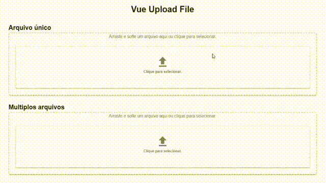

# v-upload-files
Este componente Vue oferece uma interface elegante e funcional para upload de arquivos com suporte a drag and drop, visualização dos arquivos selecionados, remoção, e botão de envio. Compatível com múltiplos arquivos e personalizável.


## 🚀 Funcionalidades
* Arraste e solte arquivos diretamente na área de upload
* Clique para selecionar arquivos manualmente
* Pré-visualização de arquivos selecionados com ícone e tamanho
* Suporte a múltiplos arquivos (modo opcional)
* Botão para enviar os arquivos
* Remoção de arquivos individuais

## Install 
#### NPM 
Para usar o componente em seu projeto Vue 3, instale o pacote via NPM:

```bash 
npm install v-upload-files
``` 
## Uso
No seu projeto Vue, importe e registre o componente:

## Exemplo de Uso
Você pode usar o componente da seguinte maneira:

```vue

<template>
   <v-upload-files @send="enviar" 
   @upload="updateFiles" 
   :multiple="true">
</v-upload-files>
</template>

<script>
import { defineComponent } from 'vue';

export default defineComponent({

   methods: {
      updateFiles(files){
         console.log('updateFiles:',files);
      },
      enviar(){
         console.log('enviar');
      }
   },
});
</script>

```
#### Props
| Prop            | Tipo    | Descrição                                                       |
| --------------- | ------- | --------------------------------------------------------------- |
| `multiple`      | Boolean | Define se o componente aceita múltiplos arquivos.               |
| `show_enviar`   | Boolean | Mostra ou oculta o botão "Enviar Arquivos".                     |
| `icone`         | String  | Ícone exibido no card de adicionar arquivos (ex: `mdi-upload`). |
| `icone_size`    | String  | Tamanho do ícone. Exemplo: `"40"`.                              |
| `text_add_html` | String  | Texto (com HTML) exibido na área de adicionar arquivos.         |


## 📦 Métodos

| Método             | Descrição                                                                          |
| ------------------ | ---------------------------------------------------------------------------------- |
| `handleDragEnter`  | Ativado ao iniciar arrastar um arquivo para a área.                                |
| `handleDragOver`   | Mantém o estado de destaque da área ao passar um arquivo sobre ela.                |
| `handleDragLeave`  | Remove o destaque da área ao sair com o arquivo.                                   |
| `handleDrop`       | Processa os arquivos soltos.                                                       |
| `handleFileSelect` | Lida com arquivos selecionados manualmente.                                        |
| `openFileDialog`   | Abre o seletor de arquivos manualmente.                                            |
| `removeFile(idx)`  | Remove um arquivo da lista, baseado no índice.                                     |
| `send`             | Executa a ação de envio dos arquivos (deve ser definida conforme sua necessidade). |


#### Slots / Personalização
Para adicionar funcionalidade de envio ou processar arquivos, você deve personalizar o método send. Ele pode, por exemplo, enviar arquivos para uma API usando axios ou fetch.


#### Estilo e Responsividade
* Responsivo com base no v-row e v-col do Vuetify
* Adapta automaticamente o número de colunas baseado na quantidade de arquivos
* Arquivos exibidos com v-card de altura fixa (150px)

#### Dependências
* Vue 3
* Vuetify 3
* Material Design Icons (para ícones como mdi-delete, mdi-upload etc.)
